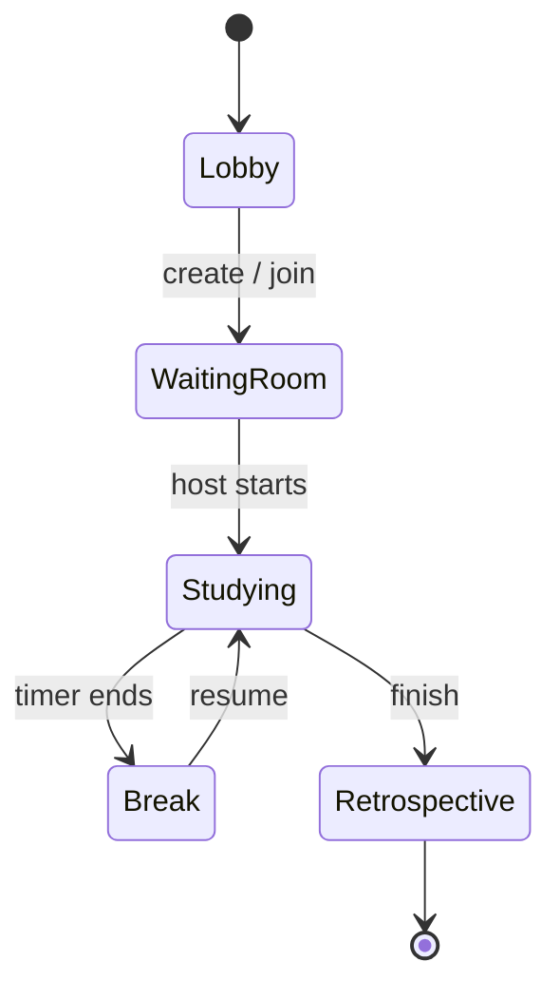
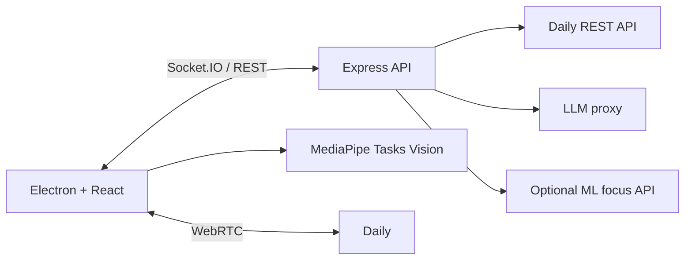

# Roomi

친구들과 함께 공부할 때 방의 흐름을 진행해 주는 AI 운영 스터디룸입니다.
Roomi는 단순 화상 통화에서 멈추지 않고 목표 설정, 집중 세션, 휴식, 복귀,
종료 회고를 하나의 상태 흐름으로 연결합니다. 같은 공간에서 즐길 수 있는
카메라 기반 표정 party game도 포함합니다.

<p align="center">
  
</p>

## 핵심 경험

- 초대 코드로 최대 4명이 같은 방에 참가
- 참가자의 목표와 play style을 반영한 session 생성
- 서버 기준 timer와 방 상태를 Socket.IO로 실시간 동기화
- Daily 기반 영상 통화
- MediaPipe 얼굴 landmark를 이용한 local focus signal
- focused, distracted, away, sleepy 상태에 따른 회복 안내
- 집중 시간 ranking과 session 종료 summary
- AI가 목표를 구체화하고 집중 회복·휴식 복귀·회고 문구를 생성
- 표정 신호를 활용한 multiplayer party game

## 사용자 흐름



방 상태는 서버가 단일 기준으로 관리합니다. 클라이언트는 snapshot과 event를
렌더링하므로 참가자별 timer drift와 서로 다른 session 상태를 줄였습니다.

## 시스템 구조



카메라 frame과 얼굴 landmark 원본은 focus 판정을 위해 클라이언트에서
처리합니다. 서버에는 방 운영에 필요한 상태 label만 전송해 영상 데이터와
session orchestration의 경계를 분리했습니다.

## 기술 스택

| 영역 | 기술 |
|---|---|
| Desktop | Electron 33, React 19, TypeScript, Vite |
| Realtime API | Express, Socket.IO |
| Video | Daily JavaScript SDK, WebRTC |
| Local vision | MediaPipe Tasks Vision |
| AI | LLM proxy, optional ML focus API |
| Monorepo | pnpm workspace |
| Quality | Vitest, Playwright, TypeScript |
| Distribution | electron-builder, Windows NSIS, macOS DMG/ZIP |

## Monorepo 구조

| 경로 | 책임 |
|---|---|
| `apps/desktop` | Electron main/preload, React renderer, focus pipeline |
| `services/api` | Room lifecycle, realtime gateway, Daily/LLM proxy |
| `packages/shared` | 공통 type, invite code, realtime event contract |
| `packages/config` | 공유 TypeScript 설정 |
| `docs/` | API, architecture, 개발·배포 문서 |

## 로컬 실행

요구 사항:

- Node.js 20+
- pnpm 9.15
- 카메라와 microphone을 사용할 수 있는 desktop 환경
- 영상 통화 기능을 사용할 경우 Daily 계정

```bash
pnpm install

# API와 desktop을 함께 실행
pnpm dev

# 또는 각각 실행
pnpm dev:api
pnpm dev:desktop
```

`services/api/.env.example`과 `apps/desktop/.env.example`을 참고해 각
process의 환경변수를 설정합니다. `DAILY_API_KEY` 같은 server secret은
desktop의 `VITE_*` 변수에 넣지 마세요.

세부 설정과 endpoint는 다음 문서를 참고하세요.

- [Architecture](docs/architecture.md)
- [API](docs/api.md)
- [Development & Distribution](docs/development_and_distribution.md)

## 검증

```bash
pnpm typecheck
pnpm lint
pnpm test
pnpm build

# Linux E2E 환경
pnpm test:e2e:linux
```

## 주요 설계 판단

### 서버 authoritative state

방 생성·참가·준비·공부·휴식·종료 전환과 timer를 서버에서 결정합니다.
늦게 참가하거나 재연결한 client도 전체 snapshot으로 현재 상태를 복구할
수 있습니다.

### 개인정보를 고려한 local focus estimation

MediaPipe landmark로 head pose, 눈 감김, 시선과 화면 이탈을 client에서
계산합니다. 원본 영상 대신 최소 상태만 공유하며, 판정이 불확실할 때는
`uncertain`으로 분리해 과도한 개입을 줄였습니다.

### 외부 provider 실패 경계

Daily room 또는 token 생성이 실패하면 local room 상태도 rollback합니다.
LLM/ML API가 설정되지 않았거나 실패한 경우에는 명시적인 오류와 fallback
경로를 사용해 핵심 room lifecycle과 분리했습니다.

## 팀

| 팀원 | GitHub | 담당 |
|---|---|---|
| 박채훈 | [@chek737](https://github.com/chek737) | 실시간 서버, LLM 운영자, API 설계 |
| 박소요 | [@oyossss](https://github.com/oyossss) | Desktop UI, session flow, camera focus detection |

KAIST MadCamp 2인 팀 프로젝트로 제작했습니다.

## 현재 상태와 한계

- MVP의 주요 room lifecycle, realtime event, video provider 연동과
  focus pipeline을 구현했습니다.
- focus 상태는 학습 성과가 아니라 관찰 가능한 신호의 추정치입니다.
- 장시간 session, 불안정한 network와 다양한 camera/조명 조건에 대한
  검증은 더 필요합니다.
- production 배포에는 Daily, API, code signing 환경을 별도로 구성해야
  합니다.
